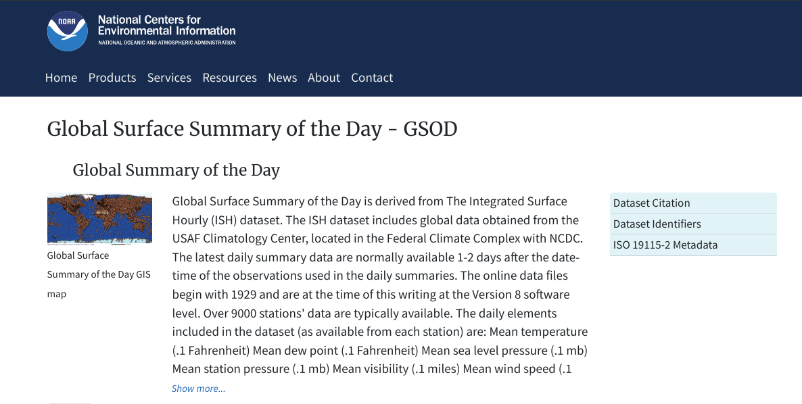
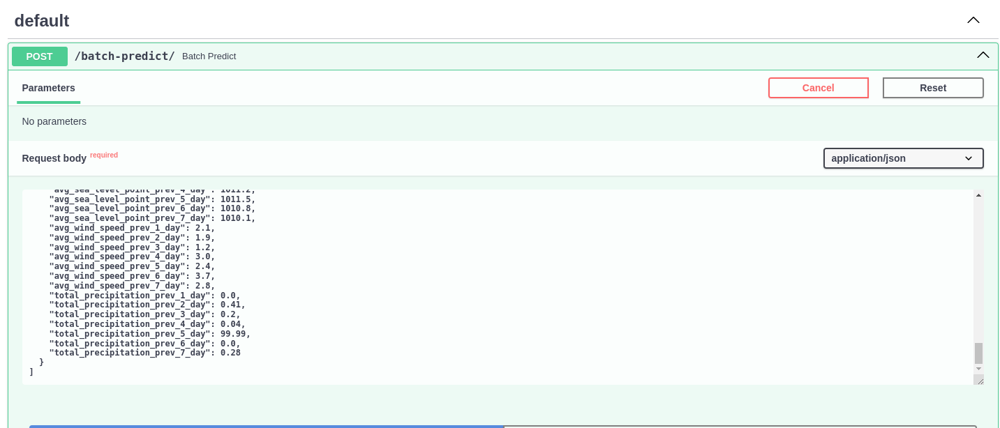
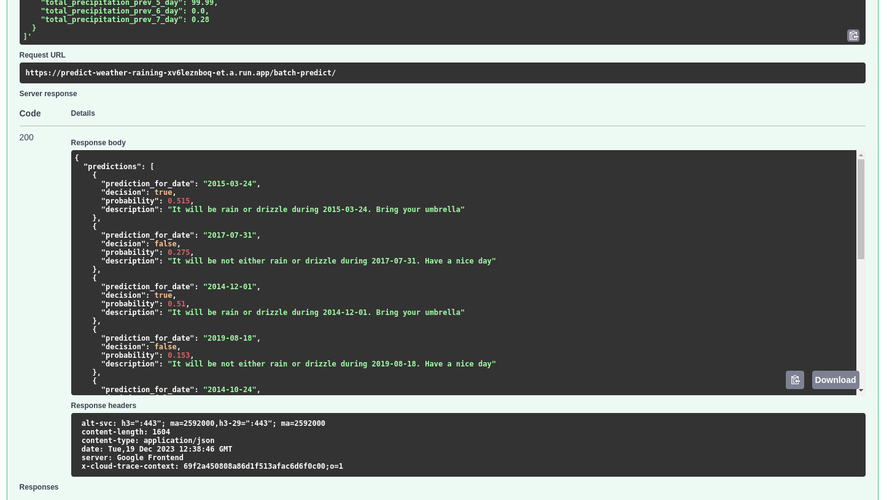

# DataTalksClub Machine Learning Zoomcamp Capstone 1 Project: Predict if Today is Raining or Drizzle

## Problem Description
Global Summary of the Day is one of the famous dataset in the BigQuery public data. This public dataset was created by National Oceanic and Atmospheric Administrator (NOAA) and it consists of daily weather elements collected from over 9000 stations in different region of country. This data includes mean value of daily temperatures, sea level pressure, wind speed, precipation and many more metric. The data also includes the column `fog, rain_drizzle, snow_ice_pellets, hail, thunder, tornado_funnel_cloud` which represent the occurence of event related to weather that reported during the day in format of binary decision (true/false).



In this project, we will use this dataset to predict if the current day will be raining or not. We will use the weather performance in the **last 7 days** from the GSOD data to predict if there is a **sign of rain or drizzle** during the day (the column `rain_drizzle`). Since the dataset is in form of daily performance, it needed to perform a feature-engineering to make the last 7 days metric is available as a feature during the training and inferencing. (eg: day-1, day-2, day-n)

## Problem Scope

The machine learning model use the data only from station id **'967450'**, which is the **JAKARTA/OBSERVATORY - INDONESIA** Station. The used dataset is data started from **2013** to **2023**. The selected features for this problem are:

Identifier:
- date: represent the date of the current day

Feature:
- year: Represent the year of the current day
- mo: Represent the month of the current day
- da: Represent the day of the current day
- avg_temp: Average temperature that recorded during the day. The metric is in Fanrenheit. Missing = 9999.9
- avg_dew_point: Dew point is a factor in the heat index. It's used to measure the water vapor content of natural gas. Using the average value. Missing = 9999.9
- avg_sea_level_point: Sea level is the average height of the ocean's surface that recorded during the day. Using the average value Missing = 9999.9
- avg_wind_speed: Mean wind speed for the day in knots to tenths. Missing = 999.9
- total_precipitation: Total precipitation (rain and/or melted snow) reported during the day in inches and hundredths; will usually not end with the midnight observation--i.e., may include latter part of previous day. .00 indicates no measurable precipitation (includes a trace). Missing = 99.99

  > Note: Many stations do not report '0' on days with no precipitation--therefore, '99.99' will often appear on these days. Also, for example, a station may only report a 6-hour amount for the period during which rain fell. See Flag field for source of data

- flag_precipitation: 
  - A = 1 report of 6-hour precipitation amount
  - B = Summation of 2 reports of 6-hour precipitation amount
  - C = Summation of 3 reports of 6-hour precipitation amount
  - D = Summation of 4 reports of 6-hour precipitation amount 
  - E = 1 report of 12-hour precipitation amount
  - F = Summation of 2 reports of 12-hour precipitation amount
  - G = 1 report of 24-hour precipitation amount
  - H = Station reported '0' as the amount for the day (eg, from 6-hour reports), but also reported at least one occurrence of precipitation in hourly observations--this could indicate a trace occurred, but should be considered as incomplete data for the day.
  - I = Station did not report any precip data for the day and did not report any occurrences of precipitation in its hourly observations--it's still possible that precip occurred but was not reported

Engineered / Augmented feature:
- <metric_name>_prev_<n>_day: The reported value of the weather metric in the previous n day. For example, `avg_temp_prev_4_day` is the value of average temperature that reported in previous 4 days. So, let say today is 2023-12-14 then `avg_temp_prev_4_day` is average temperature that recorded in 2023-12-10.
 
Target: 
- rain_drizzle: Indicators (1 = yes, 0 = no/not reported) for the occurrence during the day

Here is the query of the prepared data that we'll use in this capstone project:

```sql
WITH src AS (
  SELECT
    CASE
      WHEN date is not null 
      THEN date
      ELSE CAST(year || '-' || mo || '-' || da AS DATE)
    END AS date,
    year,
    mo,
    da,
    temp as avg_temp,
    dewp as avg_dew_point,
    slp as avg_sea_level_point,
    wdsp as avg_wind_speed,
    prcp as total_precipitation,
    flag_prcp as flag_precipitation,
    rain_drizzle,
  FROM `bigquery-public-data.noaa_gsod.gsod*`
  WHERE _TABLE_SUFFIX IN (
      '2013',
      '2014',
      '2015',
      '2016',
      '2017',
      '2018',
      '2019',
      '2020',
      '2021',
      '2022',
      '2023'
    )
    AND stn = '967450' #JAKARTA/OBSERVATORY - INDONESIA Station
)

, fill_missing_date AS (
  SELECT
    date_fill as date,
    FORMAT_DATE('%Y', date_fill) as year,
    FORMAT_DATE('%m', date_fill) as mo,
    FORMAT_DATE('%d', date_fill) as da,
    b.* EXCEPT(`date`, year, mo, da)
  FROM UNNEST(GENERATE_DATE_ARRAY('2013-01-01', '2023-12-13')) as date_fill
  LEFT JOIN src b
    ON b.date = date_fill
)

, lagging_window AS (
  SELECT
    date,
    year,
    mo,
    da,
    LAG(avg_temp, 7) OVER(date_window) as avg_temp_prev_7_day,
    LAG(avg_temp, 6) OVER(date_window) as avg_temp_prev_6_day,
    LAG(avg_temp, 5) OVER(date_window) as avg_temp_prev_5_day,
    LAG(avg_temp, 4) OVER(date_window) as avg_temp_prev_4_day,
    LAG(avg_temp, 3) OVER(date_window) as avg_temp_prev_3_day,
    LAG(avg_temp, 2) OVER(date_window) as avg_temp_prev_2_day,
    LAG(avg_temp, 1) OVER(date_window) as avg_temp_prev_1_day,
    LAG(avg_dew_point, 7) OVER(date_window) as avg_dew_point_prev_7_day,
    LAG(avg_dew_point, 6) OVER(date_window) as avg_dew_point_prev_6_day,
    LAG(avg_dew_point, 5) OVER(date_window) as avg_dew_point_prev_5_day,
    LAG(avg_dew_point, 4) OVER(date_window) as avg_dew_point_prev_4_day,
    LAG(avg_dew_point, 3) OVER(date_window) as avg_dew_point_prev_3_day,
    LAG(avg_dew_point, 2) OVER(date_window) as avg_dew_point_prev_2_day,
    LAG(avg_dew_point, 1) OVER(date_window) as avg_dew_point_prev_1_day,
    LAG(avg_sea_level_point, 7) OVER(date_window) as avg_sea_level_point_prev_7_day,
    LAG(avg_sea_level_point, 6) OVER(date_window) as avg_sea_level_point_prev_6_day,
    LAG(avg_sea_level_point, 5) OVER(date_window) as avg_sea_level_point_prev_5_day,
    LAG(avg_sea_level_point, 4) OVER(date_window) as avg_sea_level_point_prev_4_day,
    LAG(avg_sea_level_point, 3) OVER(date_window) as avg_sea_level_point_prev_3_day,
    LAG(avg_sea_level_point, 2) OVER(date_window) as avg_sea_level_point_prev_2_day,
    LAG(avg_sea_level_point, 1) OVER(date_window) as avg_sea_level_point_prev_1_day,
    LAG(avg_wind_speed, 7) OVER(date_window) as avg_wind_speed_prev_7_day,
    LAG(avg_wind_speed, 6) OVER(date_window) as avg_wind_speed_prev_6_day,
    LAG(avg_wind_speed, 5) OVER(date_window) as avg_wind_speed_prev_5_day,
    LAG(avg_wind_speed, 4) OVER(date_window) as avg_wind_speed_prev_4_day,
    LAG(avg_wind_speed, 3) OVER(date_window) as avg_wind_speed_prev_3_day,
    LAG(avg_wind_speed, 2) OVER(date_window) as avg_wind_speed_prev_2_day,
    LAG(avg_wind_speed, 1) OVER(date_window) as avg_wind_speed_prev_1_day,
    LAG(total_precipitation, 7) OVER(date_window) as total_precipitation_prev_7_day,
    LAG(total_precipitation, 6) OVER(date_window) as total_precipitation_prev_6_day,
    LAG(total_precipitation, 5) OVER(date_window) as total_precipitation_prev_5_day,
    LAG(total_precipitation, 4) OVER(date_window) as total_precipitation_prev_4_day,
    LAG(total_precipitation, 3) OVER(date_window) as total_precipitation_prev_3_day,
    LAG(total_precipitation, 2) OVER(date_window) as total_precipitation_prev_2_day,
    LAG(total_precipitation, 1) OVER(date_window) as total_precipitation_prev_1_day,
    LAG(flag_precipitation, 7) OVER(date_window) as flag_precipitation_prev_7_day,
    LAG(flag_precipitation, 6) OVER(date_window) as flag_precipitation_prev_6_day,
    LAG(flag_precipitation, 5) OVER(date_window) as flag_precipitation_prev_5_day,
    LAG(flag_precipitation, 4) OVER(date_window) as flag_precipitation_prev_4_day,
    LAG(flag_precipitation, 3) OVER(date_window) as flag_precipitation_prev_3_day,
    LAG(flag_precipitation, 2) OVER(date_window) as flag_precipitation_prev_2_day,
    LAG(flag_precipitation, 1) OVER(date_window) as flag_precipitation_prev_1_day,
    rain_drizzle
  FROM fill_missing_date
  WINDOW date_window AS (
    ORDER BY date
  )
)

SELECT *
FROM lagging_window
ORDER BY date

```

To make the scope of the problem is building the machine learning model instead of data-engineering, the data prepared and stored alongside in this repository on the directory `data/gsod_jakarta_prepared.csv`.

## Exploratory Data Analysis (EDA)

Below are the thing that performed during the Exploratory Data Analysis process:

1. Missing value checking: For the starter, the value that marked as missing will have their own value as stated in the data documentation before (eg: avg_temp will have `9999.9`). However, there is a condition when the date reported is missing in the dataset. If you take a look at the SQL query before, in the CTE: `filling_missing_date`, there is a process to make the date is available in the dataset, with the condition of the all metric value (including the `rain_drizzle`` target) having a null value. So, the missing value handling is still performed during the EDA process. 

Here is the detail of the missing value handling. Among the all columns, there is only one categorical value named: flag_precipitation. The missing value for this column was set as `OTHER`:

```
    'avg_temp': 9999.9,
    'avg_dew_point': 9999.9,
    'avg_sea_level_point': 9999.9,
    'avg_wind_speed': 999.9,
    'total_precipitation': 99.99,
    'flag_precipitation': 'OTHER'
```

We don't perform the missing value handling on the `rain_drizzle` column. As the result, the NA value were discarded.

2. Imbalance Class Check: The data ratio between the zero and one-class is 65:35. Therefore, it's important to perform a handling to Imbalance Class. So, the model doesn't have a tendency to predict the **TRUE Negative** (a non rainy prediction). In this scenario, the RandomUnderSample strategy is used to make the number zero-class samples are same with the one-class sample

3. Checking the dataset distribution. The numerical columns were visualized using the histogram of all possible values except the missing value using `binning_size=20`. Meanwhile, the categorical column distribution visualized using a bar chart. There was a skewed distribution in the column `flag_precipitation` that shows higher value of `I` compared to other values.

4. Perform the feature importance analysis to the target class. The categorical column like `flag_precipitation` will use the mutual_info score to define the feature importance. While the numerical column like `avg_temp`, `avg_dew_point`, `avg_sea_level_point`, `avg_wind_speed`, `total_precipitation` will use the correlation score to get the feature importance. This will apply into all the `prev_1_day` into `prev_7_day` column.

During the feature importance analysis, **all the precipitation** related columns have the highest feature importance both in the numerical column (total_precipitation) and categorical column (flag_precipitation). There are also some columns have a feature importance score below to 0.01 and this column were discarded during training process

More details in the Notebook: [Notebook EDA](notebook_eda.ipynb)

## Model Training
There are five models were trained on the prepared dataset from the EDA step. The dataset is splitted using ratio 60/20/20. Below is the summaries of the training process:

| Training Approach | ROC-AUC on Training Set | ROC-AUC on Validation Set | ROC-AUC on Test Set |
| ---------------|----------------------|------------------|-------------------|
| Untuned SGDClassifier | 0.515561 | 0.525430 | 0.503423 |
| Tuned SGDClassifier | 0.690540 | 0.694320 | 0.649276 |
| Untuned RandomForestClassifier | 1.000000 | 0.762830 | 0.743102 |
| Tuned RandomForestClassfier | 0.785654 | 0.774175 | 0.739666 |
| Tuned XGBoost | 0.776554 | 0.748889 | 0.724983 |

The **Untuned RandomForestClassifier** gives the best ROC-AUC on the Test-Set while **Tuned RandomForestClassifier** gives the best ROC-AUC in validation test. However, the **Untuned RandomForestClassifier** tend to be overfitting. 
  
So, we'll take the **Tuned RandomForestClassifier** as model we will use since it doesn't give an overfitting and has a best performance in the validation set.

More details in the Notebook: [Notebook Training](notebook_training.ipynb)

## Exporting Notebook to Script
  > PS: This following section and all of the next section can be found in the Notebook: [Notebook Deployment](notebook_deployment.ipynb)

To make the training phase in the file `notebook_training.ipynb` is reproducible and can be run just one single command, There is a file named `train.py` which perform all the sequences of training phase. This will produce two file, a model (final_model.bin) and dict vectorizer (final_dv.bin)

## Model Deployment
To run the model as a prediction service, there is a script named `predict.py` which generally run a FastAPI webserver as a background and process series of the inference feature to the endpoint `/batch-predict`. The `predict-test.py` file contains a sample requests and it will use the sample payload using the json file in path `sample_for_predict_test.json`.

## Dependency and Environment Management
The project use pipenv as the depenency management. The project module requirements is stored in the `Pipfile` and `Pipfile.lock`. The `Pipfile` consists the pypi's module requirements with their version's constraint. While `Pipfile.lock` file is a generated file that snapshot the packages version and hash. The `Pipfile.lock` intended to lock the package requirements so the module version is consistent and there is no accidental upgrade during the install process.

Before using the pipenv, you need to install the module:
```bash
pip install pipenv
```

After the module is installed, go to the directory `./__CAPSTONE_1` (this directory) and run this following commnand:
```bash
pipenv install
```

Then, to run the script using the installed pipenv environment. You can run this following command:
```bash
pipenv run python3 -m <name_of_script_without_dot_py>
```

## Containerization
The script to serve the model is encapsulated into one single docker image, so the execution are keep isolated from another application. A `Dockerfile` is provided in this directory for building the docker image. The `Dockerfile` will run environment and package provisioning using the **pipenv** and copy all the assets like model, dict_vectorizer and serving script (`predict.py`) to the docker image.

You can use the following command to build the image

```bash
docker build -t weather-raining-prediction .
```

After the command is succesfully run, you can run this following command to run the containerized application in the background:

```bash
docker run --rm --name weather-raining-prediction -t weather-raining-prediction
```

You can access it using port **8080** either using **localhost** or **Docker IPv4 address**. For example, if you access this url http://172.17.0.3:8080/docs, this will open the API documentation using the Docker IPv4 address


## Cloud Deployment
The capstone project were deployed using Google Cloud Run. To have project is deployed to Google Cloud Run, the final docker's image need to be pushed into the Google Container/Artifact Registry (GCR). Then, the next step is create a new deployment in the Google Cloud Run using pushed image. In this capstone project, the Google Cloud SDK - in Docker Image Distribution format - were used to run both pushing image to registry and deploy image into Google Cloud Run.

  > PS: The **Google Cloud SDK - Docker Image Distribution** format basically run a docker image of SDK with the docker socket binding to `/var/run/docker.sock`. You can check the further information on this link: https://betterprogramming.pub/about-var-run-docker-sock-3bfd276e12fd. 


### Deployment Tutorial
Here is the tutorial to deploy the image into Google Cloud Run:


1. Create a credential store for the Google Cloud SDK. This will automatically pulling the latest Google Cloud SDK using the image from `gcr.io/google.com/cloudsdktool/google-cloud-cli:alpine` if it didn't exists in te local.

```bash
docker run -ti --name gcloud-config gcr.io/google.com/cloudsdktool/google-cloud-cli:alpine /bin/bash -c 'echo "Succesfully creating GCP cred store"'
```

2. Login into GCP account using this command. Make sure to replace the value `$YOUR_PROJECT_NAME` with your active project.

3. Login to the your Google Account of the GCP project you want to access and copy the authorization code that generated right after you give the permission to access your GCP project. Put that authorization code back into the active shell and press Enter.

4. Check if you can access the GCP project by listing the project id that you have in Google Cloud Platform account. You can use this command:

```bash
docker run --rm --volumes-from gcloud-config -ti gcr.io/google.com/cloudsdktool/google-cloud-cli:alpine gcloud projects list
```

5. Run this command to deploy the local image to Google Cloud Run. This command will push the image into Google Container Registry and then deploy the pushed image into Google Cloud Run. Make sure to change `<your-gcp-region>` and `<your-gcp-project>` with value that fit with your current GCP project and settings:


```bash
docker run \
    --rm \
    --volumes-from gcloud-config \
    -v /var/run/docker.sock:/var/run/docker.sock \
    -ti gcr.io/google.com/cloudsdktool/google-cloud-cli:alpine \
    /bin/bash -c "gcloud auth configure-docker <your-gcp-region>-docker.pkg.dev && docker tag weather-raining-prediction <your-gcp-region>-docker.pkg.dev/<your-gcp-project>/cloud-run-source-deploy/weather-raining-prediction && docker push <your-gcp-region>-docker.pkg.dev/<your-gcp-project>/cloud-run-source-deploy/weather-raining-prediction"
```

The current model already served and it is accessible from this url: https://predict-weather-raining-xv6leznboq-et.a.run.app/

### How to use the API

There are two ways to use the served model:


1. You can access the Swagger UI of the FastAPI. Go to the section of endpoint `/batch-predict` and try to input using sample value that provided in the `data/sample_for_predict_test.json`. The accepted payload is an array with contains list of object with these attributes:

```json
{
  "date": "YYYY-MM-DD",
  "flag_precipitation_prev_1_day": <string>,
  "flag_precipitation_prev_2_day": <string>,
  "flag_precipitation_prev_3_day": <string>,
  "flag_precipitation_prev_4_day": <string>,
  "flag_precipitation_prev_5_day": <string>,
  "flag_precipitation_prev_6_day": <string>,
  "flag_precipitation_prev_7_day": <string>,
  "avg_temp_prev_1_day": <float>,
  "avg_temp_prev_2_day": <float>,
  "avg_temp_prev_3_day": <float>,
  "avg_temp_prev_4_day": <float>,
  "avg_temp_prev_5_day": <float>,
  "avg_temp_prev_6_day": <float>,
  "avg_temp_prev_7_day": <float>,
  "avg_dew_point_prev_1_day": <float>,
  "avg_dew_point_prev_2_day": <float>,
  "avg_dew_point_prev_3_day": <float>,
  "avg_dew_point_prev_4_day": <float>,
  "avg_dew_point_prev_5_day": <float>,
  "avg_dew_point_prev_6_day": <float>,
  "avg_dew_point_prev_7_day": <float>,
  "avg_sea_level_point_prev_1_day": <float>,
  "avg_sea_level_point_prev_2_day": <float>,
  "avg_sea_level_point_prev_3_day": <float>,
  "avg_sea_level_point_prev_4_day": <float>,
  "avg_sea_level_point_prev_5_day": <float>,
  "avg_sea_level_point_prev_6_day": <float>,
  "avg_sea_level_point_prev_7_day": <float>,
  "avg_wind_speed_prev_1_day":<float>,
  "avg_wind_speed_prev_2_day":<float>,
  "avg_wind_speed_prev_3_day":<float>,
  "avg_wind_speed_prev_4_day": <float>,
  "avg_wind_speed_prev_5_day":<float>,
  "avg_wind_speed_prev_6_day":<float>,
  "avg_wind_speed_prev_7_day":<float>,
  "total_precipitation_prev_1_day":<float>,
  "total_precipitation_prev_2_day": <float>,
  "total_precipitation_prev_3_day":<float>,
  "total_precipitation_prev_4_day": <float>,
  "total_precipitation_prev_5_day": <float>,
  "total_precipitation_prev_6_day":<float>,
  "total_precipitation_prev_7_day": <float>
}
```






2. Trying directly using curl command. For example:

```bash
curl -X 'POST' \
  'https://predict-weather-raining-xv6leznboq-et.a.run.app/batch-predict/' \
  -H 'accept: application/json' \
  -H 'Content-Type: application/json' \
  -d '[
  {
    "date": "2020-11-08",
    "flag_precipitation_prev_1_day": "I",
    "flag_precipitation_prev_2_day": "B",
    "flag_precipitation_prev_3_day": "A",
    "flag_precipitation_prev_4_day": "A",
    "flag_precipitation_prev_5_day": "OTHER",
    "flag_precipitation_prev_6_day": "I",
    "flag_precipitation_prev_7_day": "A",
    "avg_temp_prev_1_day": 84.2,
    "avg_temp_prev_2_day": 82.1,
    "avg_temp_prev_3_day": 81.5,
    "avg_temp_prev_4_day": 83.6,
    "avg_temp_prev_5_day": 83.8,
    "avg_temp_prev_6_day": 83.5,
    "avg_temp_prev_7_day": 81.9,
    "avg_dew_point_prev_1_day": 76.0,
    "avg_dew_point_prev_2_day": 76.4,
    "avg_dew_point_prev_3_day": 76.0,
    "avg_dew_point_prev_4_day": 75.2,
    "avg_dew_point_prev_5_day": 74.1,
    "avg_dew_point_prev_6_day": 74.4,
    "avg_dew_point_prev_7_day": 74.6,
    "avg_sea_level_point_prev_1_day": 1010.2,
    "avg_sea_level_point_prev_2_day": 1011.7,
    "avg_sea_level_point_prev_3_day": 1011.4,
    "avg_sea_level_point_prev_4_day": 1011.2,
    "avg_sea_level_point_prev_5_day": 1011.5,
    "avg_sea_level_point_prev_6_day": 1010.8,
    "avg_sea_level_point_prev_7_day": 1010.1,
    "avg_wind_speed_prev_1_day": 2.1,
    "avg_wind_speed_prev_2_day": 1.9,
    "avg_wind_speed_prev_3_day": 1.2,
    "avg_wind_speed_prev_4_day": 3.0,
    "avg_wind_speed_prev_5_day": 2.4,
    "avg_wind_speed_prev_6_day": 3.7,
    "avg_wind_speed_prev_7_day": 2.8,
    "total_precipitation_prev_1_day": 0.0,
    "total_precipitation_prev_2_day": 0.41,
    "total_precipitation_prev_3_day": 0.2,
    "total_precipitation_prev_4_day": 0.04,
    "total_precipitation_prev_5_day": 99.99,
    "total_precipitation_prev_6_day": 0.0,
    "total_precipitation_prev_7_day": 0.28
  }
  ]'
```

## Thank You