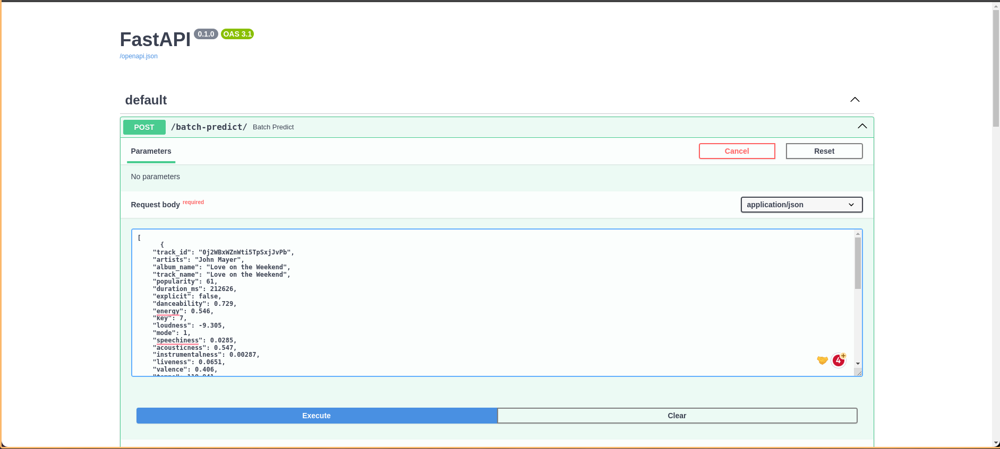
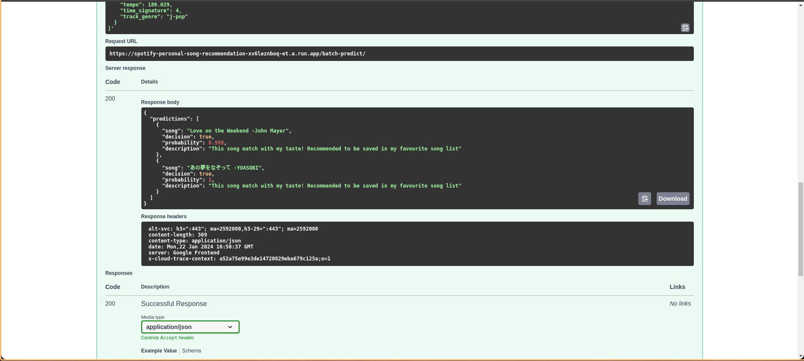

# DataTalksClub Machine Learning Zoomcamp Capstone 2 Project: Predict if Song will be Liked by Me

## Problem Description
This is a dataset of Spotify tracks over a range of 125 different ranges. Each of track has some audio features that associated with it. In this project, the dataset will be used to detect if a track will be liked and saved to favourites by me. The original dataset will be labeled with the column `is_liked`. The column is `is_liked` is generated from the list of songs in my personal liked song in spotify. You can check the script for performing labelling in this notebook: [Data Labelling](data/saved_song_data_ingestion.ipynb)


The dataset source: https://www.kaggle.com/datasets/maharshipandya/-spotify-tracks-dataset

## Problem Scope
The project will use some of following columns from the source dataset:
- track_id (not used during training)
- artists 
- album_name (not used during training)
- track_name (not used during training)
- popularity
- duration_ms
- explicit
- danceability
- energy
- key
- loudness
- mode
- speechiness
- acousticness
- instrumentalness
- liveness
- valence
- tempo
- time_signature (not used due to feature importance analysis. see below)
- track_genre 

Target:
- `is_liked`: Represent if song in dataset is available in my personal liked songs in Spotify

You can check the labeled dataset on the file `data/labeled_dataset.csv`

## Exploratory Data Analysis (EDA)
These are steps that performed during Exploratory Data Analysis

1. **Check The Missing Value**: There is only three columns (`artists`, `album_name`, `track_name`) and one that marked as missing value. Since it's also not labeled as `is_liked`, we can safely take out the record from the training set

2. **Check the Distribution**: The ratio between positive class and negative class is **99.52 / 0.42** from total of 113999 records. Therefore, we need to perform sampling both oversampling (making the positive class sample increase) and undersampling (making the negative class same with the positive class).

In this project, SMOTENC (Synthetic Minority Over-sampling Technique for Nominal and Continuous) will be used to performing over-sampling with the ratio of 0.1. After Oversampling is performed on the positive class, the undersample is run to make negative class is equal with the positive class.

After performing a sampling, there are **11344** records in the training set, ready to be used

3. **Checking the dataset distribution**: The numerical columns were visualized using the histogram of all possible values except the missing value using `binning_size=20`

4. **Performing the Feature Importance Analysis**: The categorical columns like `artists` and `track-genre` will used mutual info score to determine the importance score of the feature. While the rest categorical column will use feature correlation to target columns to determine the feature importance.

The five most importance features are `popularity` (numerical), `artists` (categorical), `track_genre` (catergorical), `loudness` (numerical), and `instrumentalness` (numerical). While the lowest important feature is: `time_signature`. We will excluded this `time_signature` column during model building

More details in the Notebook: [Notebook EDA](notebook_eda.ipynb)

## Model Training
There are three models were trained on the prepared dataset from the EDA step. The dataset is splitted using ratio 60/20/20. Below is the summaries of the training process:

| Training Approach | ROC-AUC on Training Set | ROC-AUC on Validation Set | ROC-AUC on Test Set |
| ---------------|----------------------|------------------|-------------------|
| Untuned SGDClassifier | 0.5 | 0.5 | 0.5 |
| Tuned SGDClassifier | 0.809194	 | 0.828962 | 0.799881 |
| Tuned LGBM | 1.000000	 | 0.997281	 | 0.996127 |

> Summary: Tuned LGBM gives the ROC-AUC boost both in training, validation, and test set. It also gives the best ROC-AUC compared to SGDClassifier both tuned and untuned version. In this experiment, we can also see that SGDClassifier performing well when it's tuned rather than plain SGDClassifier

More details in the Notebook: [Notebook Training](notebook_training.ipynb)

## Exporting Notebook to Script
  > PS: This following section and all of the next section can be found in the Notebook: [Notebook Deployment](notebook_deployment.ipynb)

There is a file named `train.py` which basically performing all sequences of training process from file `notebook_training.ipynb`. This script will produce two files, a model and the dict vectorizer

## Model Deployment
To run the model as a prediction service, there is a script named `predict.py` which generally run a FastAPI webserver as a background and process series of the inference feature to the endpoint `/batch-predict`. The `predict-test.py` file contains a sample requests and it will use the sample payload using the json file in path `sample_for_predict_test.json`.

## Dependency and Environment Management
The project use pipenv as the depenency management. The project module requirements is stored in the `Pipfile` and `Pipfile.lock`. The `Pipfile` consists the pypi's module requirements with their version's constraint. While `Pipfile.lock` is a lock file to make sure the dependency is consistent when the pipenv command is run multiple times (because there is a chance of pipenv upgrading the package if there is no `Pipfile.lock`)

Before using the pipenv, you need to install the `pipenv`:
```bash
pip install pipenv
```

Go to the directory `./__CAPSTONE_2` (this directory) and run this following commnand:
```bash
pipenv install
```

You can run this following command to run the script using the prepared pipenv environment:
```bash
pipenv run python3 -m <name_of_script_without_dot_py>
```

## Containerization
The script to serve the model is packed into one single docker image, so the execution are keep isolated from another application. A `Dockerfile` is provided in this directory for building the docker image. The defined `Dockerfile` will run environment and package provisioning using the **pipenv** and copy model, dict_vectorizer and serving script (`predict.py`) to the ready docker image.

You can use the following command to build the image

```bash
docker build -t spotify-personal-song-recommendation .
```

After the command is succesfully run, you can run this following command to run the containerized application in the background:

```bash
docker run --rm --name spotify-personal-song-recommendation -t spotify-personal-song-recommendation
```

## Deployment and How to Use API
You can find it on the Jupyter Notebook file [Notebook Deployment](notebook_deployment.ipynb), specifically on section **Deploying Service to Cloud**.

To use the API, you can go to endpoint: https://spotify-personal-song-recommendation-xv6leznboq-et.a.run.app/batch_predict and put this example of payload. Make sure the JSON object that will be send is inside the JSON Array (since the `/batch-predict` endpoint accept the array of object payload). For example

```json
[
  {
    "track_id": "4BE1OloRc9xwjyqA4wFFuN",
    "artists": "YOASOBI",
    "album_name": "\u3042\u306e\u5922\u3092\u306a\u305e\u3063\u3066",
    "track_name": "\u3042\u306e\u5922\u3092\u306a\u305e\u3063\u3066",
    "popularity": 65,
    "duration_ms": 242666,
    "explicit": false,
    "danceability": 0.537,
    "energy": 0.793,
    "key": 8,
    "loudness": -3.446,
    "mode": 1,
    "speechiness": 0.04,
    "acousticness": 0.217,
    "instrumentalness": 0.000361,
    "liveness": 0.143,
    "valence": 0.73,
    "tempo": 180.029,
    "time_signature": 4,
    "track_genre": "j-pop"
  },
  {
    "track_id": "0j2WBxWZnWti5TpSxjJvPb",
    "artists": "John Mayer",
    "album_name": "Love on the Weekend",
    "track_name": "Love on the Weekend",
    "popularity": 61,
    "duration_ms": 212626,
    "explicit": false,
    "danceability": 0.729,
    "energy": 0.546,
    "key": 7,
    "loudness": -9.305,
    "mode": 1,
    "speechiness": 0.0285,
    "acousticness": 0.547,
    "instrumentalness": 0.00287,
    "liveness": 0.0651,
    "valence": 0.406,
    "tempo": 119.941,
    "time_signature": 4,
    "track_genre": "singer-songwriter"
  }
]
```

Or you can access the FastAPI docs on the same link but different route: https://spotify-personal-song-recommendation-xv6leznboq-et.a.run.app/docs. Here you can interactively test the endpoint using the previous sample data



