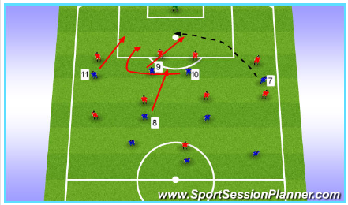
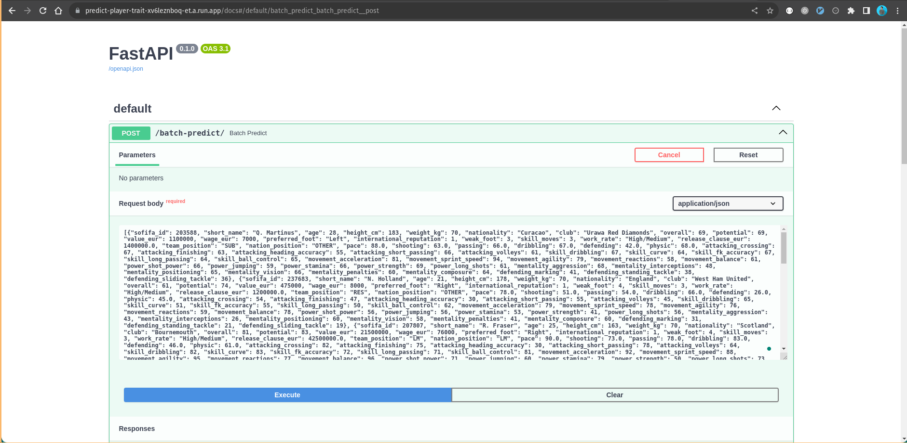
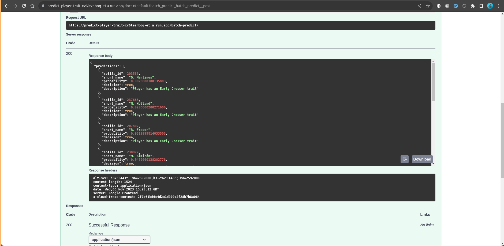

# DataTalksClub Machine Learning Zoomcamp Midterm Project: Predict FIFA 20 Player with Trait Early Crosser

## Problem Description

In FIFA 20, some of player have traits which represent the in-game characteristic that give the player a unique skills & distinct player style between the players. There are so many player traits that available in the FIFA 20, for example: Leadership, Clinical Finisher, Speedster, Long Shooter and many more. In this case, the goal is to predict if a player has a trait an **Early Crosser**. An Early Crosser itself described as a player with a tendency to perform a direct cross to the open spaces of opponent's penalty area before reaching the end line or corner flag. This kind of player usually has a vision of the other teammates movement to the open-spaces in the front of the opponent's penalty area combined with a good long ball cross. While at the same time, there are multiple attributes that made the player has a Early Crosser trait.



The dataset that will be used to perform this following task is come from this url: https://www.kaggle.com/datasets/stefanoleone992/fifa-20-complete-player-dataset?select=players_20.csv

The dataset basically consists a FIFA player id and player name with the skill attribute (eg: attacking, shooting, physic, and more) which represented in numerical attributes, while it's also has a categorical attribute like team name, position, nationality, prefered_foot and many more. We will use some of this attribute to perform binary-classification task that produce a decision if the player has a trait Early Crosser or not.

## Personal Rationale

To make the complexity of model is small, the training will only use a attribute that related to the player's skills statistic (eg: dribbling, defending, attacking, etc). The player overall attributes in the specific position (eg: lb, lcb, cb) will be discarded. Some of the attributes also doesn't make sense to be used in the training phase. Eg: real_face which represent if the player has a real face in the FIFA games, player jersey number which doesn't seems has a impact to the training phase. Therefore, it will be discarded from the model building.

From the personal feature selection, here is the attribute that will be included into ML model building. The `sofifa_id` and `short_name` only act as identifier. The early crosser trait available in the column `player_traits`

Identifier
- sofifa_id
- short_name

Feature
- age
- height_cm
- weight_kg
- nationality
- club
- overall (overall score in FIFA 20)
- potential (the potential score that predicted int FIFA 20)
- value_eur
- wage_eur
- preferred_foot
- international_reputation
- weak_foot
- skill_moves
- work_rate
- release_clause_eur
- team_position
- nation_position
- pace
- shooting
- passing
- dribbling
- defending
- physic
- attacking_crossing
- attacking_finishing
- attacking_heading_accuracy
- attacking_short_passing
- attacking_volleys
- skill_dribbling
- skill_curve
- skill_fk_accuracy
- skill_long_passing
- skill_ball_control
- movement_acceleration
- movement_sprint_speed
- movement_agility
- movement_reactions
- movement_balance
- power_shot_power
- power_jumping
- power_stamina
- power_strength
- power_long_shots
- mentality_aggression
- mentality_interceptions
- mentality_positioning
- mentality_vision
- mentality_penalties
- mentality_composure
- defending_marking
- defending_standing_tackle
- defending_sliding_tackle

Target
- player_traits (only select the **Early Crosser** and mark player which has the related trait using **value=1** and **value=0** respectively)


## Exploratory Data Analysis (EDA)

Here is the EDA that performed before the model building
1. Missing Value Checking: There are 9 columns of that has a missing value. Seven columns are classified as a numerical feature while the other is a categorical. The numerical features columns are release_clause_eur, pace, shooting, passing, dribbling, defending and physic and it's safe to fill it with **zero value**, since the zero itself represent the lowest possible value of those features. While the categorical features like team_position and nation_position will be filled with **OTHER** category

2. Imbalance Class Check: The data ratio between a player with trait Early Crosser and Not is 10:90. Therefore, it's necessary to make the data distribution ratio is same for both class to avoid the higher True Negative prediction in the model. In this case, the **RandomUnderSample** strategies is used to perform a sampling of the Negative class, so the distribution will be same with the Positive class.

3. Checking the player distribution. eg: Average, STD dev, Min-Max value and the Quartile value for the each features.

4. Perform a feature importance analysis towards the target class. The categorical features used mutual info_score, while the numerical features used correlation score as a method to peform feature importance analysis. During the feature importance analysis, only one feature that didn't have any correlation towards the target, which is `preferred_foot`. Therefore, it will be excluded from model building phase

During the feature importance analysis, there are interesting fact that the feature importance analysis suprisingly showed that the highly correlated attribute of early-crosser player is an attribute that related to the **movement** (agility, acceleration, sprint_speed, pace) rather than the attribute that related to the crossing itself (eg: attacking_crossing, passing, skill_curve, mentality_vision).


## Model Training

There are three models were trained on the dataset. The dataset were splitted as train/val/test by ratio of 60/20/20 %. Here is the summary of training and the ROC metric that scored from the validation datasets:

| Model                                                 | Model Param (The best model if tuned)                | ROC AUC Score on val dataset (in %) |
|-------------------------------------------------------|---------------------------------|-------------------------------|
| Logistic Regression                                   | `LogisticRegression(random_state=42, solver='liblinear')`                                                       | 75.275                         |
| Logistic Regression (tuned with RandomizedCVSearch)   | `LogisticRegression(C=0.5, max_iter=1000, random_state=42, solver='liblinear', tol=1e-05)`                         | 91.672                         |
| XG Boost (tuned with RandomizedCVSearch)              | `XGBClassifier(min_child_weight=10, eta=0.1, max_depth=3)`                                                       | 91.721                         |

The Best model is using XGBClassifier. More details on: `notebook.ipynb`

## Exporting Notebook to Script
To make the training phase is reproducible, the training process exported to the different file named `train.py`. This will produce a model file (`model.bin`) with the vectorizer file (`dv.bin`).

## Model Deployment
Model is deployed and served using FastAPI. You can find the script to serve the model on the `predict.py` while `predict-test.py` is a script to perform a request to the served model

## Dependency and Environment Management
The project use a `pipenv` as a dependency and environment management. The packages requirement are stored into the `Pipfile` and `Pipfile.lock`. The packages dependency can be installed on the separated environment of execution by using `pipenv install` command that run directly from the active project directory (in this case was: `.__MIDTERM__`)

## Containerization
The script to serve model using a FastAPI and the required module were encapsulated into one single docker image. A Dockerfile is provided in the project to build the image. To build the image, you can use this command

```bash
docker build -t player-trait-prediction .
```

## Cloud Deployment
The **Google Cloud Run** is used as place to serve the model. To make the requirement and procedure to deploy in Google Cloud Run to be more standardize, a Google Cloud SDK CLI docker version combined with docker socket binding strategy (more information: https://betterprogramming.pub/about-var-run-docker-sock-3bfd276e12fd) will be used from pushing the image to the Google Container Registry to deploying the pushed image as a service into the Google Cloud Run

Here is step by step:


1. Create a container to store the authorized GCP account first using this command

```bash
docker run -ti --name gcloud-config gcr.io/google.com/cloudsdktool/google-cloud-cli:alpine /bin/bash -c 'echo "Succesfully creating GCP cred store"'
```

2. Login to the GCP account and set the project-id

```bash
docker run --rm --volumes-from gcloud-config -ti gcr.io/google.com/cloudsdktool/google-cloud-cli:alpine /bin/bash -c 'gcloud auth login --no-launch-browser && gcloud config set project $YOUR_PROJECT_NAME'
```

3. Login to the Google Account and copy the authorization code that generated after authenticated back into the input prompt that showed in shell. Press Enter

4. Check that you have an access to GCP project by running this command

```bash
docker run --rm --volumes-from gcloud-config -ti gcr.io/google.com/cloudsdktool/google-cloud-cli:alpine gcloud projects list
```

5. Run this command to perform a authentication with Container Registry, tag the image and then push your image into Google Container Registry

```bash
docker run \
    --rm \
    --volumes-from gcloud-config \
    -v /var/run/docker.sock:/var/run/docker.sock \
    -ti gcr.io/google.com/cloudsdktool/google-cloud-cli:alpine \
    /bin/bash -c "gcloud auth configure-docker your-gcp-region-docker.pkg.dev && docker tag player-trait-prediction your-gcp-region-docker.pkg.dev/your-gcp-project/cloud-run-source-deploy/player-trait-prediction && docker push your-gcp-region-docker.pkg.dev/your-gcp-project/cloud-run-source-deploy/player-trait-prediction"
```

6. After it pushed into Google Container Registry, run this following command to create a Cloud Run service and serve them through cloud:

```bash
docker run \
    --rm \
    --volumes-from gcloud-config \
    -v /var/run/docker.sock:/var/run/docker.sock \
    -ti gcr.io/google.com/cloudsdktool/google-cloud-cli:alpine \
    /bin/bash -c 'gcloud run deploy predict-player-trait --region your-gcp-region --allow-unauthenticated --image your-gcp-region-docker.pkg.dev/your-gcp-project/cloud-run-source-deploy/player-trait-prediction'
```

The model already served to the cloud and it's accessible from this url: https://predict-player-trait-xv6leznboq-et.a.run.app/batch-predict/

There are two ways to run the prediction service from the deployed app

1. Directly by performing POST request to the https://predict-player-trait-xv6leznboq-et.a.run.app/batch-predict/

```
curl -X 'POST' \
  'https://predict-player-trait-xv6leznboq-et.a.run.app/batch-predict/' \
  -H 'accept: application/json' \
  -H 'Content-Type: application/json' \
  -d '[{"sofifa_id": 203588, "short_name": "Q. Martinus", "age": 28, "height_cm": 183, "weight_kg": 70, "nationality": "Curacao", "club": "Urawa Red Diamonds", "overall": 69, "potential": 69, "value_eur": 1100000, "wage_eur": 7000, "preferred_foot": "Left", "international_reputation": 1, "weak_foot": 3, "skill_moves": 3, "work_rate": "High/Medium", "release_clause_eur": 1400000.0, "team_position": "SUB", "nation_position": "OTHER", "pace": 88.0, "shooting": 63.0, "passing": 66.0, "dribbling": 67.0, "defending": 42.0, "physic": 68.0, "attacking_crossing": 67, "attacking_finishing": 63, "attacking_heading_accuracy": 55, "attacking_short_passing": 66, "attacking_volleys": 61, "skill_dribbling": 67, "skill_curve": 64, "skill_fk_accuracy": 67, "skill_long_passing": 64, "skill_ball_control": 65, "movement_acceleration": 81, "movement_sprint_speed": 94, "movement_agility": 79, "movement_reactions": 58, "movement_balance": 61, "power_shot_power": 66, "power_jumping": 59, "power_stamina": 66, "power_strength": 69, "power_long_shots": 61, "mentality_aggression": 68, "mentality_interceptions": 48, "mentality_positioning": 65, "mentality_vision": 66, "mentality_penalties": 60, "mentality_composure": 64, "defending_marking": 41, "defending_standing_tackle": 38, "defending_sliding_tackle": 36}, {"sofifa_id": 237683, "short_name": "N. Holland", "age": 21, "height_cm": 178, "weight_kg": 70, "nationality": "England", "club": "West Ham United", "overall": 61, "potential": 74, "value_eur": 475000, "wage_eur": 8000, "preferred_foot": "Right", "international_reputation": 1, "weak_foot": 4, "skill_moves": 3, "work_rate": "High/Medium", "release_clause_eur": 1200000.0, "team_position": "RES", "nation_position": "OTHER", "pace": 78.0, "shooting": 51.0, "passing": 54.0, "dribbling": 66.0, "defending": 26.0, "physic": 45.0, "attacking_crossing": 54, "attacking_finishing": 47, "attacking_heading_accuracy": 30, "attacking_short_passing": 55, "attacking_volleys": 45, "skill_dribbling": 65, "skill_curve": 51, "skill_fk_accuracy": 55, "skill_long_passing": 50, "skill_ball_control": 62, "movement_acceleration": 79, "movement_sprint_speed": 78, "movement_agility": 76, "movement_reactions": 59, "movement_balance": 78, "power_shot_power": 56, "power_jumping": 56, "power_stamina": 53, "power_strength": 41, "power_long_shots": 56, "mentality_aggression": 43, "mentality_interceptions": 26, "mentality_positioning": 60, "mentality_vision": 58, "mentality_penalties": 41, "mentality_composure": 60, "defending_marking": 31, "defending_standing_tackle": 21, "defending_sliding_tackle": 19}, {"sofifa_id": 207807, "short_name": "R. Fraser", "age": 25, "height_cm": 163, "weight_kg": 70, "nationality": "Scotland", "club": "Bournemouth", "overall": 81, "potential": 83, "value_eur": 21500000, "wage_eur": 76000, "preferred_foot": "Right", "international_reputation": 1, "weak_foot": 4, "skill_moves": 3, "work_rate": "High/Medium", "release_clause_eur": 42500000.0, "team_position": "LM", "nation_position": "LM", "pace": 90.0, "shooting": 73.0, "passing": 78.0, "dribbling": 83.0, "defending": 46.0, "physic": 61.0, "attacking_crossing": 82, "attacking_finishing": 75, "attacking_heading_accuracy": 30, "attacking_short_passing": 78, "attacking_volleys": 64, "skill_dribbling": 82, "skill_curve": 83, "skill_fk_accuracy": 72, "skill_long_passing": 71, "skill_ball_control": 81, "movement_acceleration": 92, "movement_sprint_speed": 88, "movement_agility": 95, "movement_reactions": 77, "movement_balance": 96, "power_shot_power": 71, "power_jumping": 60, "power_stamina": 79, "power_strength": 50, "power_long_shots": 73, "mentality_aggression": 65, "mentality_interceptions": 45, "mentality_positioning": 77, "mentality_vision": 80, "mentality_penalties": 69, "mentality_composure": 79, "defending_marking": 45, "defending_standing_tackle": 53, "defending_sliding_tackle": 42}, {"sofifa_id": 230977, "short_name": "M. Almir\u00f3n", "age": 25, "height_cm": 174, "weight_kg": 63, "nationality": "Paraguay", "club": "Newcastle United", "overall": 80, "potential": 83, "value_eur": 18500000, "wage_eur": 52000, "preferred_foot": "Left", "international_reputation": 1, "weak_foot": 2, "skill_moves": 4, "work_rate": "High/High", "release_clause_eur": 36500000.0, "team_position": "LS", "nation_position": "CAM", "pace": 89.0, "shooting": 74.0, "passing": 76.0, "dribbling": 82.0, "defending": 48.0, "physic": 63.0, "attacking_crossing": 72, "attacking_finishing": 73, "attacking_heading_accuracy": 43, "attacking_short_passing": 80, "attacking_volleys": 75, "skill_dribbling": 83, "skill_curve": 74, "skill_fk_accuracy": 70, "skill_long_passing": 70, "skill_ball_control": 81, "movement_acceleration": 89, "movement_sprint_speed": 89, "movement_agility": 87, "movement_reactions": 79, "movement_balance": 64, "power_shot_power": 78, "power_jumping": 46, "power_stamina": 84, "power_strength": 53, "power_long_shots": 73, "mentality_aggression": 65, "mentality_interceptions": 50, "mentality_positioning": 74, "mentality_vision": 78, "mentality_penalties": 69, "mentality_composure": 76, "defending_marking": 43, "defending_standing_tackle": 53, "defending_sliding_tackle": 49}, {"sofifa_id": 207651, "short_name": "Dolly Menga", "age": 26, "height_cm": 180, "weight_kg": 73, "nationality": "Angola", "club": "Livingston FC", "overall": 64, "potential": 67, "value_eur": 575000, "wage_eur": 2000, "preferred_foot": "Left", "international_reputation": 1, "weak_foot": 4, "skill_moves": 3, "work_rate": "Medium/Low", "release_clause_eur": 1000000.0, "team_position": "RES", "nation_position": "OTHER", "pace": 83.0, "shooting": 60.0, "passing": 52.0, "dribbling": 68.0, "defending": 51.0, "physic": 70.0, "attacking_crossing": 57, "attacking_finishing": 60, "attacking_heading_accuracy": 59, "attacking_short_passing": 58, "attacking_volleys": 59, "skill_dribbling": 69, "skill_curve": 44, "skill_fk_accuracy": 38, "skill_long_passing": 43, "skill_ball_control": 64, "movement_acceleration": 83, "movement_sprint_speed": 83, "movement_agility": 75, "movement_reactions": 61, "movement_balance": 71, "power_shot_power": 66, "power_jumping": 78, "power_stamina": 55, "power_strength": 72, "power_long_shots": 56, "mentality_aggression": 80, "mentality_interceptions": 54, "mentality_positioning": 55, "mentality_vision": 51, "mentality_penalties": 55, "mentality_composure": 58, "defending_marking": 45, "defending_standing_tackle": 52, "defending_sliding_tackle": 49}, {"sofifa_id": 233841, "short_name": "C. Cuesta", "age": 20, "height_cm": 178, "weight_kg": 67, "nationality": "Colombia", "club": "KRC Genk", "overall": 66, "potential": 77, "value_eur": 1000000, "wage_eur": 3000, "preferred_foot": "Right", "international_reputation": 1, "weak_foot": 3, "skill_moves": 2, "work_rate": "Low/Medium", "release_clause_eur": 1700000.0, "team_position": "SUB", "nation_position": "OTHER", "pace": 78.0, "shooting": 26.0, "passing": 44.0, "dribbling": 49.0, "defending": 64.0, "physic": 68.0, "attacking_crossing": 28, "attacking_finishing": 21, "attacking_heading_accuracy": 69, "attacking_short_passing": 66, "attacking_volleys": 33, "skill_dribbling": 40, "skill_curve": 32, "skill_fk_accuracy": 20, "skill_long_passing": 35, "skill_ball_control": 48, "movement_acceleration": 76, "movement_sprint_speed": 80, "movement_agility": 76, "movement_reactions": 61, "movement_balance": 69, "power_shot_power": 31, "power_jumping": 78, "power_stamina": 68, "power_strength": 75, "power_long_shots": 30, "mentality_aggression": 50, "mentality_interceptions": 63, "mentality_positioning": 20, "mentality_vision": 36, "mentality_penalties": 34, "mentality_composure": 58, "defending_marking": 62, "defending_standing_tackle": 65, "defending_sliding_tackle": 65}, {"sofifa_id": 234983, "short_name": "Q. La\u00e7i", "age": 23, "height_cm": 180, "weight_kg": 80, "nationality": "Albania", "club": "AC Ajaccio", "overall": 66, "potential": 74, "value_eur": 950000, "wage_eur": 2000, "preferred_foot": "Right", "international_reputation": 1, "weak_foot": 3, "skill_moves": 3, "work_rate": "Medium/Medium", "release_clause_eur": 1900000.0, "team_position": "RDM", "nation_position": "OTHER", "pace": 73.0, "shooting": 65.0, "passing": 64.0, "dribbling": 67.0, "defending": 57.0, "physic": 68.0, "attacking_crossing": 63, "attacking_finishing": 66, "attacking_heading_accuracy": 52, "attacking_short_passing": 67, "attacking_volleys": 59, "skill_dribbling": 65, "skill_curve": 67, "skill_fk_accuracy": 53, "skill_long_passing": 62, "skill_ball_control": 67, "movement_acceleration": 74, "movement_sprint_speed": 72, "movement_agility": 78, "movement_reactions": 64, "movement_balance": 67, "power_shot_power": 69, "power_jumping": 73, "power_stamina": 75, "power_strength": 62, "power_long_shots": 65, "mentality_aggression": 71, "mentality_interceptions": 49, "mentality_positioning": 59, "mentality_vision": 61, "mentality_penalties": 54, "mentality_composure": 61, "defending_marking": 58, "defending_standing_tackle": 61, "defending_sliding_tackle": 58}, {"sofifa_id": 213822, "short_name": "L. Cabrera", "age": 25, "height_cm": 167, "weight_kg": 73, "nationality": "Chile", "club": "Audax Italiano", "overall": 67, "potential": 71, "value_eur": 900000, "wage_eur": 2000, "preferred_foot": "Right", "international_reputation": 1, "weak_foot": 2, "skill_moves": 3, "work_rate": "Medium/Medium", "release_clause_eur": 1300000.0, "team_position": "SUB", "nation_position": "OTHER", "pace": 59.0, "shooting": 48.0, "passing": 59.0, "dribbling": 68.0, "defending": 67.0, "physic": 71.0, "attacking_crossing": 61, "attacking_finishing": 42, "attacking_heading_accuracy": 52, "attacking_short_passing": 71, "attacking_volleys": 32, "skill_dribbling": 64, "skill_curve": 35, "skill_fk_accuracy": 33, "skill_long_passing": 62, "skill_ball_control": 72, "movement_acceleration": 61, "movement_sprint_speed": 57, "movement_agility": 76, "movement_reactions": 54, "movement_balance": 86, "power_shot_power": 64, "power_jumping": 66, "power_stamina": 72, "power_strength": 72, "power_long_shots": 49, "mentality_aggression": 70, "mentality_interceptions": 59, "mentality_positioning": 54, "mentality_vision": 48, "mentality_penalties": 40, "mentality_composure": 59, "defending_marking": 75, "defending_standing_tackle": 71, "defending_sliding_tackle": 64}, {"sofifa_id": 239742, "short_name": "J. Klinsmann", "age": 22, "height_cm": 194, "weight_kg": 84, "nationality": "United States", "club": "FC St. Gallen", "overall": 61, "potential": 73, "value_eur": 350000, "wage_eur": 2000, "preferred_foot": "Right", "international_reputation": 1, "weak_foot": 2, "skill_moves": 1, "work_rate": "Medium/Medium", "release_clause_eur": 578000.0, "team_position": "SUB", "nation_position": "OTHER", "pace": 0.0, "shooting": 0.0, "passing": 0.0, "dribbling": 0.0, "defending": 0.0, "physic": 0.0, "attacking_crossing": 14, "attacking_finishing": 5, "attacking_heading_accuracy": 14, "attacking_short_passing": 26, "attacking_volleys": 19, "skill_dribbling": 19, "skill_curve": 11, "skill_fk_accuracy": 13, "skill_long_passing": 19, "skill_ball_control": 19, "movement_acceleration": 29, "movement_sprint_speed": 29, "movement_agility": 35, "movement_reactions": 42, "movement_balance": 39, "power_shot_power": 49, "power_jumping": 49, "power_stamina": 45, "power_strength": 59, "power_long_shots": 19, "mentality_aggression": 25, "mentality_interceptions": 14, "mentality_positioning": 8, "mentality_vision": 29, "mentality_penalties": 13, "mentality_composure": 28, "defending_marking": 10, "defending_standing_tackle": 12, "defending_sliding_tackle": 13}, {"sofifa_id": 155266, "short_name": "A. Askar", "age": 33, "height_cm": 174, "weight_kg": 62, "nationality": "Ethiopia", "club": "Sarpsborg 08 FF", "overall": 64, "potential": 64, "value_eur": 200000, "wage_eur": 1000, "preferred_foot": "Right", "international_reputation": 1, "weak_foot": 2, "skill_moves": 3, "work_rate": "High/Medium", "release_clause_eur": 250000.0, "team_position": "SUB", "nation_position": "OTHER", "pace": 71.0, "shooting": 63.0, "passing": 62.0, "dribbling": 71.0, "defending": 58.0, "physic": 50.0, "attacking_crossing": 66, "attacking_finishing": 56, "attacking_heading_accuracy": 64, "attacking_short_passing": 64, "attacking_volleys": 63, "skill_dribbling": 70, "skill_curve": 58, "skill_fk_accuracy": 64, "skill_long_passing": 55, "skill_ball_control": 68, "movement_acceleration": 70, "movement_sprint_speed": 72, "movement_agility": 85, "movement_reactions": 66, "movement_balance": 80, "power_shot_power": 78, "power_jumping": 68, "power_stamina": 72, "power_strength": 34, "power_long_shots": 71, "mentality_aggression": 60, "mentality_interceptions": 56, "mentality_positioning": 66, "mentality_vision": 60, "mentality_penalties": 38, "mentality_composure": 63, "defending_marking": 58, "defending_standing_tackle": 57, "defending_sliding_tackle": 54}]'
```

2. Trying from FastAPI swagger https://predict-player-trait-xv6leznboq-et.a.run.app/docs. Put some of sample data on the `/batch-predict/` route



